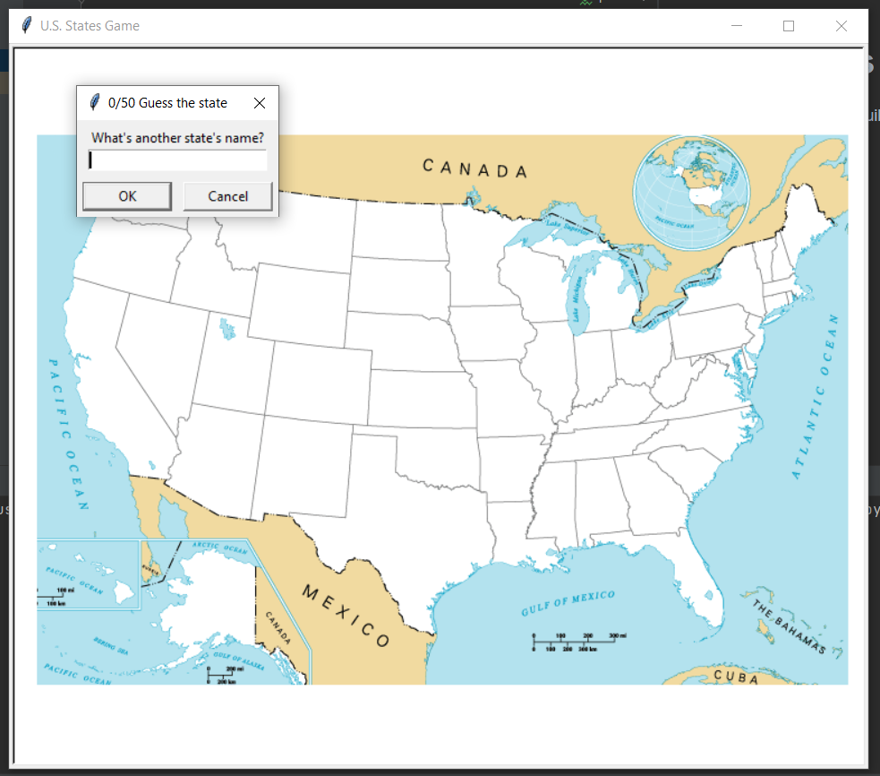
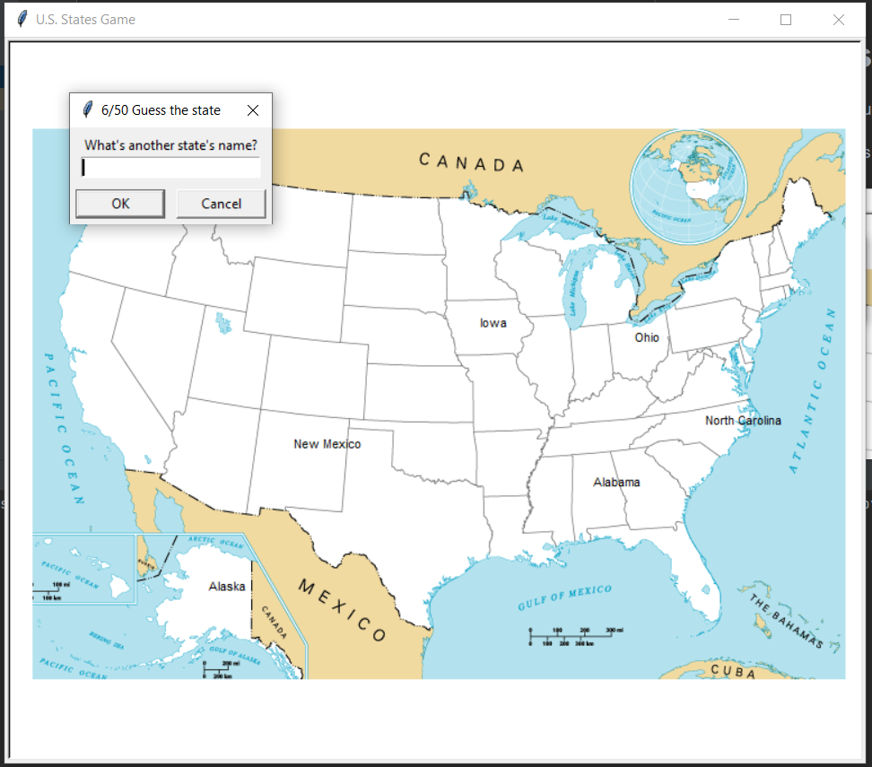
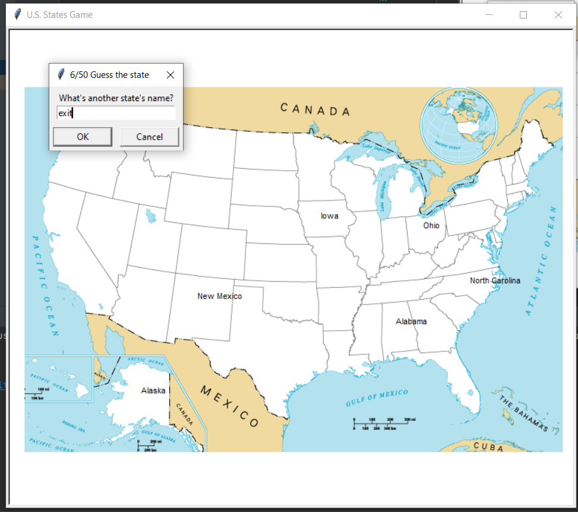

# USA States Games
 A usa states quiz game built with python and pandas, turtle packages

when the game start looks like this:

A medida que vaya adivinando los diferentes estados se iran aumentando los puntos y los estados iran apareciendo en pantalla.

Also there is a secret text to finish the game and get the missing states in the project folder.
This keyword is "exit"

if you want to change the states or their position just changed in the "states.csv" file and if yo want to do the same with the background just update the "background.gif" file with another gif file.

Enjoy the game!